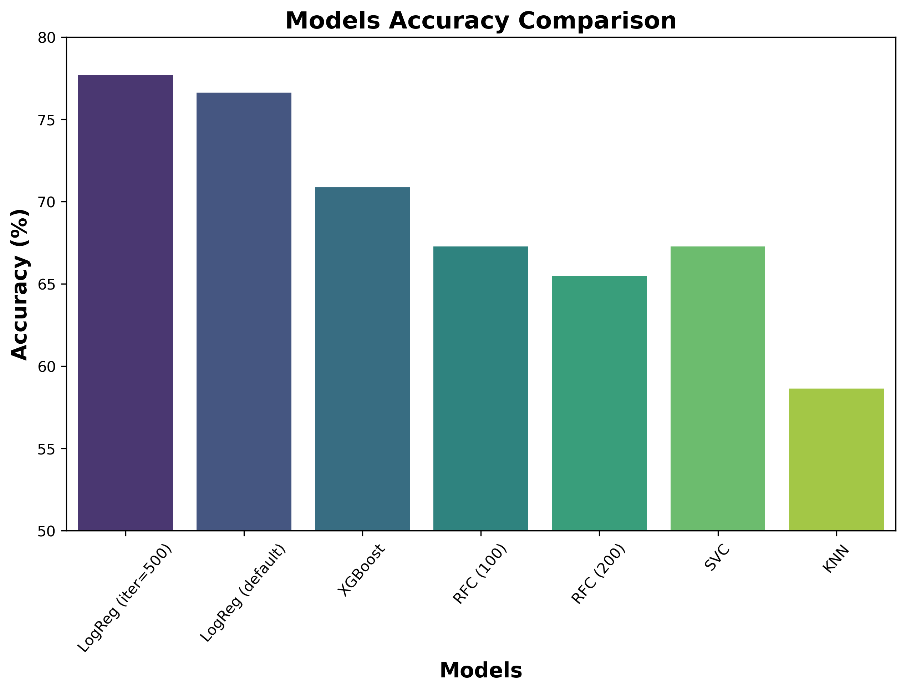

# Emotion Recognition  
This emotion recognition system recognizes three emotions—`happy`, `sad` and `surprise`— from the facial expressions. After experimenting with different machine learning algorithms to train the model, the highest accuracy was achieved with `Logistic Regression` at **77.70**. The best-performing model is then used in this emotion recognition system.  
Facial landmarks (features) are extracted from image dataset using the `MediaPipe library` and saved as a numpy array to `data.txt`. The models are then trained on the data stored in `data.txt`.

## Dataset  
* The data consists of 48x48 pixel grayscale images of faces.
* The images are categorized into three classes: `happy`, `sad` and `surprise`.
* Each class have 500 images, it is taken randomly from [FER2013 dataset](https://www.kaggle.com/datasets/msambare/fer2013).

---
<div style="display: flex; justify-content: space-between;">
  <div style="flex: 1;">
  
  ### Models Accuracy Table

  | Model                          | Accuracy (%) |
  |---------------------------------|--------------|
  | LogisticRegression (max_iter=500)| **77.70**   |
  | LogisticRegression (default)    | 76.62        |
  | XGBoost (GradientBoosting)      | 70.86        |
  | RandomForest (n_estimators=100) | 67.27        |
  | RandomForest (n_estimators=200) | 65.47        |
  | SVC                             | 67.27        |
  | KNN                             | 58.63        |

  </div>
  <div style="flex: 1; text-align: center;">
  
  ### Model Accuracy Comparison
  
  

  </div>
</div>


## 🚀 Quick Start

**1. Clone the repository:**
   ```
   git clone https://github.com/ImranNawar/emotion-recognition.git
   ```

**2. Install dependencies:**
   ```
   pip install -r requirements.txt
   ```

**3. Prepare the data**
   * Create a folder by the name `data` which have three sub folders—`happy`, `sad` and `surprise`.
   * Add images to the subfolders.
   * Execute `prepare_data.py`.
   * The result is a dataset of facial landmarks with corresponding emotion labels stored in a file `data.txt`, suitable for training a machine learning model for emotion recognition.
   * This process is memory extensive, it requires alot of memory
   * If your system have less memory, then close other applications or you may decrease number of images.
   ```
   python prepare_data.py
   ```
   
**4. Train the model**
   ```
   python train_model.py
   ```

**5. Run the application:**
   ```
   python test_model.py
   ```

## 📁 Project Structure

```bash
emotion-recognition/
├── data/
│   ├── happy/
│   ├── sad/
│   └── surprise/
├── images/
│   └── model_accuracy_comparison.png
├── notebook/
│   └── train_model.ipynb
├── .gitignore
├── LICENSE
├── prepare_data.py
├── README.md
├── requirements.txt
├── test_model.py
├── train_model.py
├── utils.py
├── data.txt                      # ignored in .gitignore
└── model                         # Saved model (ignored in .gitignore)
```

## 📄 License
This project is licensed under the [MIT License](LICENSE).